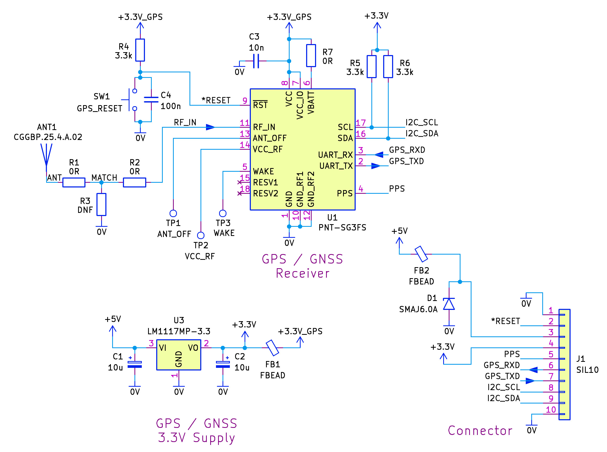
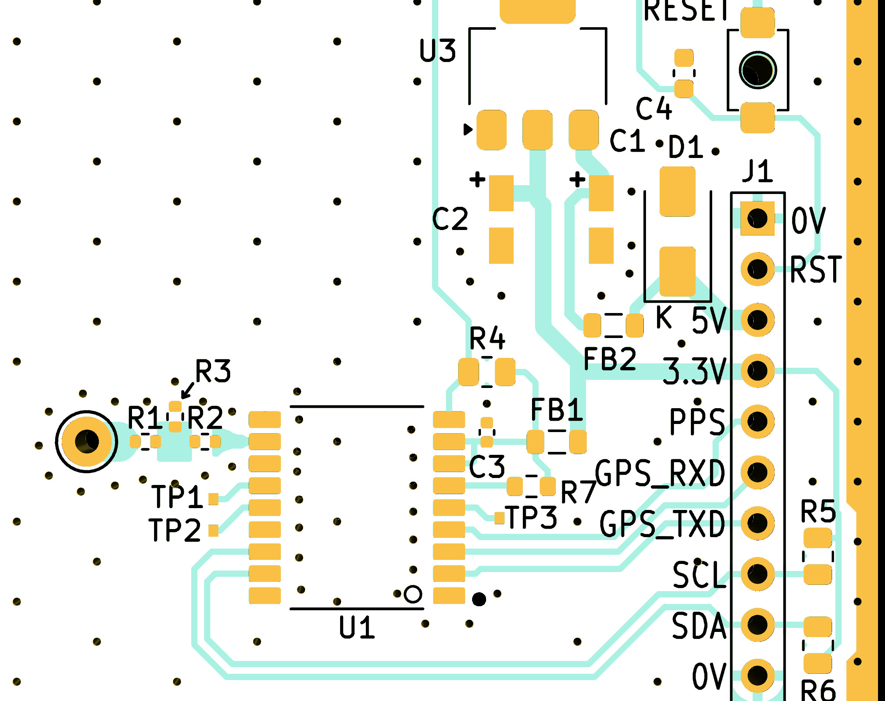

# teseo_iii_gnss

This repository contains the PCB Gerber files for building the following circuit:


Parts list:

```
ANT1: Taoglas CGGBP.25.4.A.02 antenna
C1,C2: 10uF tantalum capacitor, case size 'A', TAJA106K010RNJ
C3: 10nF capacitor X7R 0402
C4: 100nF capacitor 0603,
D1: TVS diode, 6V, SMAJ6.0A
FB1,FB2: Ferrite bead, 0805, HZ0805G471R-10
J1: 10-way 2.54mm single-in-line (SIL) pin header
R1,R2: 0 ohm resistor, 0402
R7: 0 ohm resistor, 0603
R3: do not fit
R4: 100k resistor, 0805
R5,R6: 3.3k resistor, 0805
SW1: 4x3mm tact switch SMD
U1: Lantronix PNT-SG3FS or (possibly) ST TESEO-LIV3F
U3: LM1117MP-3.3 voltage regulator, SOT-223
```




The board expects **3.3V logic levels**, but is powered from **5V**. If you wish to use a higher voltage (up to 12V) to power the board, then TVS diode D1 needs to be removed or changed to a different value.

To test the board, it is recommended to obtain a USB-UART adapter, and download ST Teseo Suite Pro.

The repository also contains an Arduino library. The Arduino must use **3.3V logic-levels** (_not_ 5V), and must support a **Serial1** interface. The Arduino Uno R3, and the classic Arduino Nano, do _not_ support a Serial1 interface.
Make the following connections to the Arduino:

```
Module Pin	J1 Pin on PCB	  Arduino Pin	   Description
2	          7	              D0/RX	         Transmit from GNSS (GPS_TX)
3	          6	              D1/TX	         Transmit from Arduino (GPS_RX)
-	          3	              5V	           5V supply for GNSS board
-	          1	              GND	           GND
```
To use the Arduino library, in the Arduino development environment, click on **Sketch->Include Library->Add .ZIP file**.

Then, click on **File->Examples->Teseo Library->TeseoTest**

When run, you'll repeatedly see raw NMEA-format output appear on the Arduino Serial Monitor, followed by a decode of the content.
